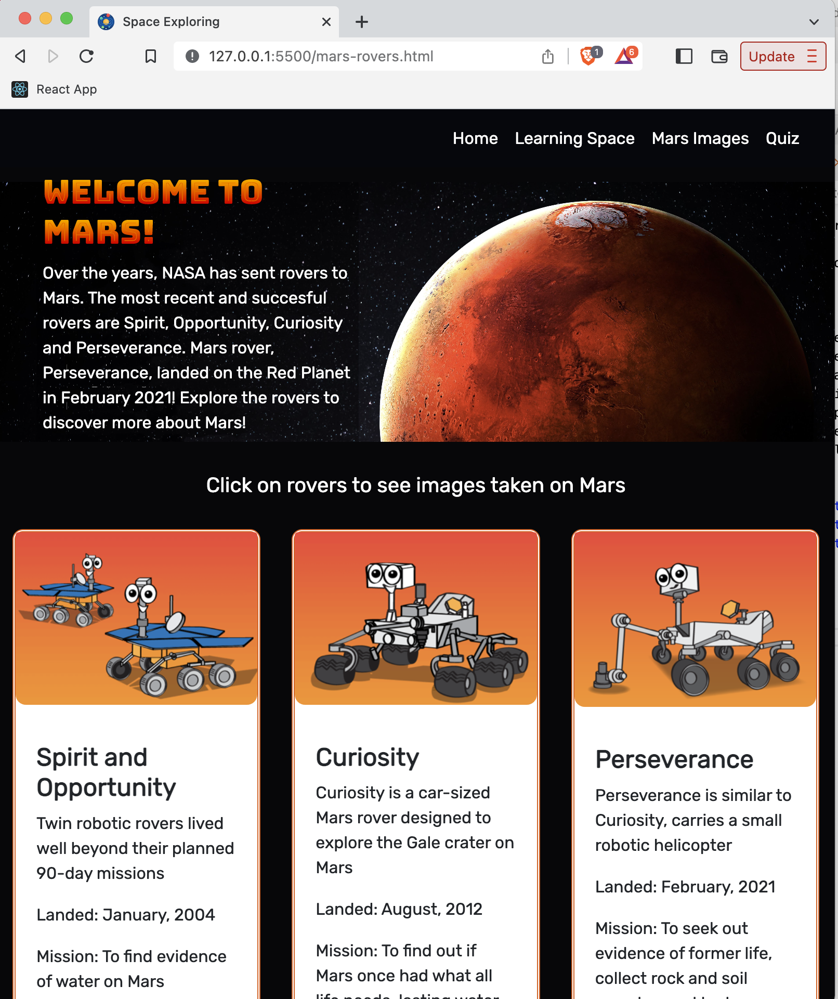

# Space Exploring

## The application is live at: https://ljenchik.github.io/space-exploring/

Welcome to Space Exploring! It's a website for children and teenagers about space which was created by the team of two (ljenchik and mateusuk). The website allows users to explore interesting facts about our solar system, view images taken by Mars rovers, and score the most in the space quiz. We used the data from NASA Open API (https://api.nasa.gov) and The Solar System OpenData (https://api.le-systeme-solaire.net/en/). 

### Usage

As a user I want to learn about Space and Mars Rovers, view images from Mars and take a quiz to test my knowledge about our Solar System.

- When a user opens a home page they are presented with the carousel of space images that also serve as the links to the other website pages: Learning Space, Mars Rovers and Quiz. Home page is featured with the section of interesting facts about space and the following paragraphs that lead to the other pages of the website.

  
  
  

-  Learning Space page displays eight planets. When a user clicks on the card, the information about the corresponding planet appears on the back of the card; when a user clicks on cross at the top of the info card, the planet image will be displayed again.

  
  
  

- Mars Rovers page presents the three images of Mars rovers, a few key details about rovers and the links for further reading. When a user clicks on one of the rovers, they are able to choose a date from the datepicker, and then view a carousel of ten random images taken by the chosen rover on the chosen date. If no images were taken on the date, the error message will be displayed prompting a user to choose another date.

 

    
    
    

- A multiple choices quiz which contains twelve random questions about space can be found on Quiz page. When a user clicks on a start button a timer starts and the first question appears. Only one of the available answers is correct. When answer is clicked, the next question appears. If the answer clicked was incorrect then ten seconds are subtracted from the timer. The quiz ends when all questions are answered or the timer reaches 0. When the game ends, it displays a table with players' initials and their scores.

 

    
    

All pages are responsive and are designed in the same style.

